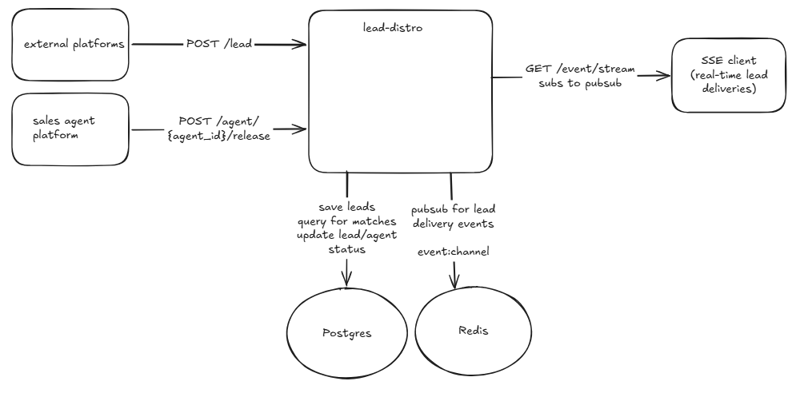
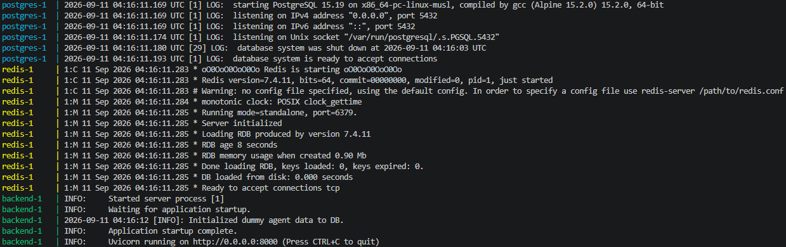
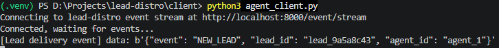
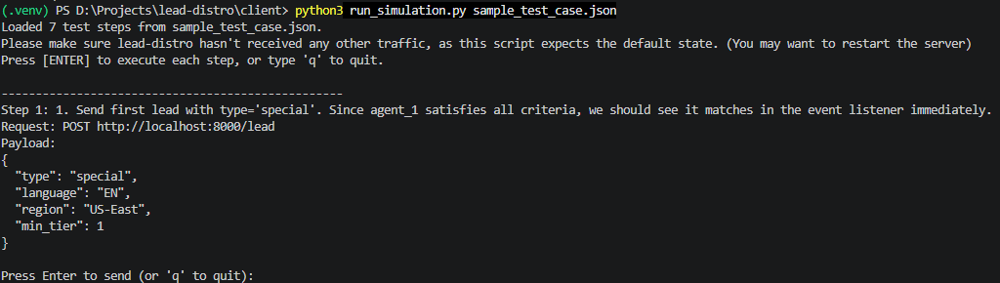

# lead-distro

This project assumes incoming leads from various platforms come as POST HTTP requests that include information about the potential customer (e.g. location, lead type, language, etc.). It also assumes another POST HTTP request will be sent whenever a sales agent becomes available to process a lead.

The core service matches leads to eligible sales agents only when all the following attributes match: sales agent availility, type, tier, location, language, and when the agent was last matched.

The service guarantees that as soon as a lead comes in, if there are eligible sales agents available, the lead will be delivered immediately. Otherwise if there are no eligible sales agents, the lead will be stored in a PENDING state and will not be discarded. As soon as an agent does become available, the lead that has been PENDING the longest and that matches that agent will be delivered.

For demo purposes, we listen to an SSE stream to emulate real-time lead delivery from an agent perspective.



Note: for simplicity we will use a hardcoded set of 6 sales agents:
```bash
    (agent_id="agent_1", type="special", tier=1, region="US-East", language="EN"),
    (agent_id="agent_2", type="pro", tier=2, region="US-West", language="EN"),
    (agent_id="agent_3", type="general", tier=1, region="US-West", language="EN"),
    (agent_id="agent_4", type="general", tier=1, region="US-East", language="EN"),
    (agent_id="agent_5", type="general", tier=3, region="US-East", language="EN"),
    (agent_id="agent_6", type="general", tier=3, region="US-Central", language="EN")
```

## How to Run
1. Clone repo
    ```bash
    git clone https://github.com/pjhu6/lead-distro.git
    cd lead-distro
    ```

2. Make sure Docker is installed: https://www.docker.com/products/docker-desktop/
3. Build and compose docker:
    ```bash
    docker compose up --build
    ```
4. You should see 3 containers launch successfully.
    
5. The core backend is now up and running at `localhost:8000`.

## How to Test
Once the core backend is running, we can either test by manually sending requests to the server or use the test scripts in the `client` directory to run a test suite.

### Testing Manually
1. First, connect to SSE to view all lead delivery events as soon as they happen.
```bash
curl -N "http://localhost:8000/event/stream"
```
2. Simulate an incoming lead
```bash
curl -X POST "http://localhost:8000/lead" -H "Content-Type: application/json" -d "{\"type\": \"general\", \"language\": \"EN\", \"region\": \"US-East\", \"min_tier\": 2}"
```

3. Simulate a sales agent becoming available
```bash
curl -X POST http://localhost:8000/agent/agent_5/release
```

4. As new leads come in or sales agents become available, we can see events stream in. These events reprsent a lead being delivered to a sales agent.
```bash
C:\Users\Patrick>curl -N "http://localhost:8000/event/stream"
data: b'{"event": "NEW_LEAD", "lead_id": "lead_15877d20", "agent_id": "agent_1"}'
data: b'{"event": "NEW_LEAD", "lead_id": "lead_8c06d257", "agent_id": "agent_2"}'
```

### Run Test Suites
1. Open a second terminal (terminal 2) and install dependencies
    ```bash
    pip install httpx
    ```

2. Run sales agent client in terminal 2. This connects to the SSE endpoint and will display lead delivery events as soon as they happen.
    ```bash
    cd client
    python3 agent_client.py
    ```

    

3. The test cases are stored in json format (`client/sample_test_case.json`). Each json object represents a HTTP request.

4. Open a third terminal to run the simulation script with the test case json. The script will let you send each request one by one and give you time to observe the event in terminal 2. Please refer to the descriptions in `client/sample_test_case.json` to see which test cases are included.
    ```bash
    python3 run_simulation.py sample_test_case.json
    ```
    

5. Note: the test suites expect the agents/leads to be in the default state, so you may need to restart the service if it already received some traffic.